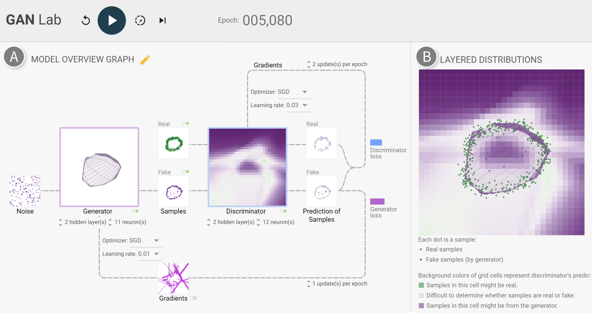

# CGAN: An Interactive, Visual Experimentation Tool for Conditional Generative Adversarial Networks

## Overview

This is an extension of GAN lab, with an additional of labels to visualize how the model can take advantage of the labels during the training process to better generate the image. GAN lab is a novel interactive visualization tool for anyone to learn and experiment with Generative Adversarial Networks (GANs), a popular class of complex deep learning models.

With GAN Lab, you can interactively train GAN models for 2D data distributions and visualize their inner-workings, similar to [TensorFlow Playground](http://playground.tensorflow.org/).

GAN Lab uses [TensorFlow.js](https://js.tensorflow.org/), an in-browser GPU-accelerated deep learning library. Everything, from model training to visualization, is implemented with JavaScript. Users only need a web browser like Chrome to run GAN Lab. This implementation approach significantly broadens people's access to interactive tools for deep learning.

The label is from the MNIST dataset, from numbers 1-4. This CGAN model will thus generate the shape of "1" - "4".



## Working Demo

Click the following link:

[https://sleepreap.github.io/cgan/](https://sleepreap.github.io/cgan/)

It runs on most modern web browsers. Google Chrome is suggested.

## Development

This section describes how you can develop get this to run on local server.

### Install Dependencies

1. Make sure node.js is installed.
2. Install Node Version Manager so that you can install previous version of node since this github repo uses node version 9.
3. Install node version 9

```bash
nvm install 9
```

4. Make sure to change to node version 9 using the following commands:

```bash
nvm use 9
```

5. Download the Github Repo. Run the following commands:

```bash
$ git clone https://github.com/sleepreap/cgan.git
$ cd cgan
$ yarn prep
```

It's unlikely, but you may need to install some basic JavaScript-related dependencies (e.g., yarn).

### Running Your Demo

Run the following command:

```bash
$ ./scripts/watch-demo

>> Waiting for initial compile...
>> 3462522 bytes written to demo/bundle.js (2.17 seconds) at 00:00:00
>> Starting up http-server, serving ./
>> Available on:
>>   http://127.0.0.1:8080
>> Hit CTRL-C to stop the server
```

Then visit `http://localhost:8080/demo/`.

The `watch-demo` script monitors for changes of typescript code (e.g., `demo/ganlab.ts`)
and compiles the code for you.

## Credit

GAN Lab was created by
[Minsuk Kahng](http://minsuk.com),
[Nikhil Thorat](https://twitter.com/nsthorat),
[Polo Chau](https://www.cc.gatech.edu/~dchau/),
[Fernanda Viégas](http://www.fernandaviegas.com/), and
[Martin Wattenberg](http://www.bewitched.com/),
which was the result of a research collaboration between Georgia Tech and Google Brain/[PAIR](https://ai.google/research/teams/brain/pair).
We also thank Shan Carter and Daniel Smilkov,
[Google Big Picture team](https://research.google.com/bigpicture/) and
[Google People + AI Research (PAIR)](https://ai.google/research/teams/brain/pair), and
[Georgia Tech Visualization Lab](http://vis.gatech.edu/)
for their feedback.

For more information, check out
[our research paper](http://minsuk.com/research/papers/kahng-ganlab-vast2018.pdf):

[Minsuk Kahng](http://minsuk.com),
[Nikhil Thorat](https://twitter.com/nsthorat),
[Polo Chau](https://www.cc.gatech.edu/~dchau/),
[Fernanda Viégas](http://www.fernandaviegas.com/), and
[Martin Wattenberg](http://www.bewitched.com/).
"GAN Lab: Understanding Complex Deep Generative Models using Interactive Visual Experimentation."
_IEEE Transactions on Visualization and Computer Graphics, 25(1) ([VAST 2018](http://ieeevis.org/year/2018/welcome))_, Jan. 2019.
